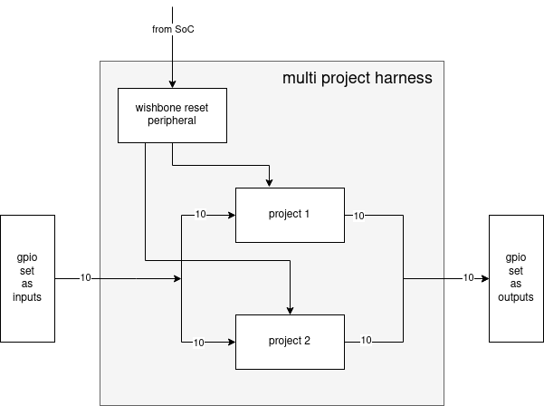
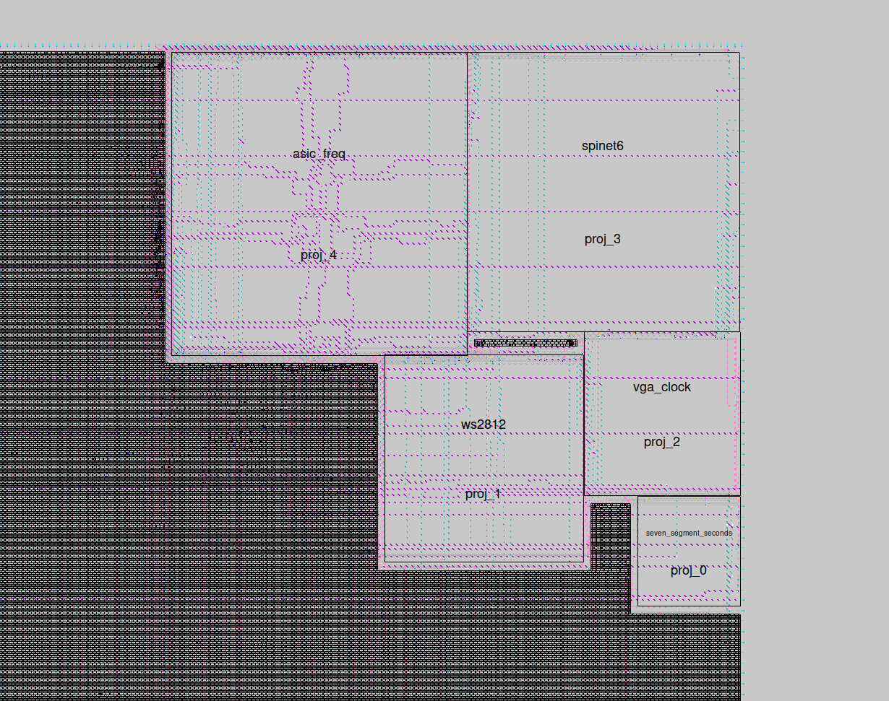

# Multi Project Harness

This is a proposal for handling multiple projects in the user project area of the [Caravel harness](https://github.com/efabless/caravel)

clone with --recursive to get the demo project [seven segment seconds](https://github.com/mattvenn/seven-segment-seconds)

You will also need cocotb and iverilog installed.

    install iverilog from source git://github.com/steveicarus/iverilog.git
    pip3 install cocotb

# Process of adding a new design

## Context 1: add to multi-project-harness

* add design as a submodule
* add a test to the test_harness.py

## Context 2: Caravel
* clone caravel and add this repo as a submodule in caravel/verilog/rtl
* add firmware and test in caravel/verilog/dv/caravel/user_proj_example
* run the test and check your design is selected and generating expected signals. Best if the testbench actually checks something basic.

# Context 3: OpenLane

each design is hardened (turned into a GDS2 layout).  Designs and this harness are aggregated into 1 macro following this pattern: https://github.com/efabless/openlane/tree/master/designs/manual_macro_placement_test

* harden your design but don't route the top metal power lines by setting in config: set ::env(DESIGN_IS_CORE) 0
* copy all the macros gds and lef into macros/gds & macros/lef
* harden top level multi-project-harness
* ? How to do within Caravel.

# Unknowns/Assumptions

* how to do clock? will there be a dedicated clock from SoC?
* haven't tested the manual macro placement yet as it is currently broken with openlane rc4
* how to put the final macro into the user project area of Caravel.

# Demo

run a simulation of activating one design and then the next:

    make sim
    make gtkwave

run a formal proof that the mux is correct

    make formal

# Example config

* Working [config.tcl](example/config.tcl)
* Slightly adapted [top.v](top.v) by adding blackboxed modules: [src/top.v](example/src/top.v)
